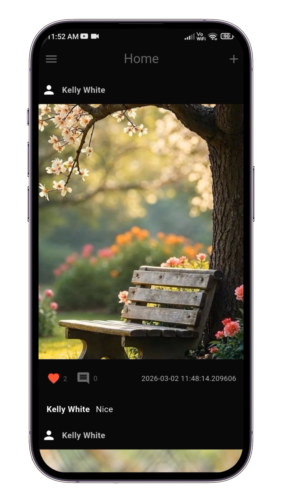
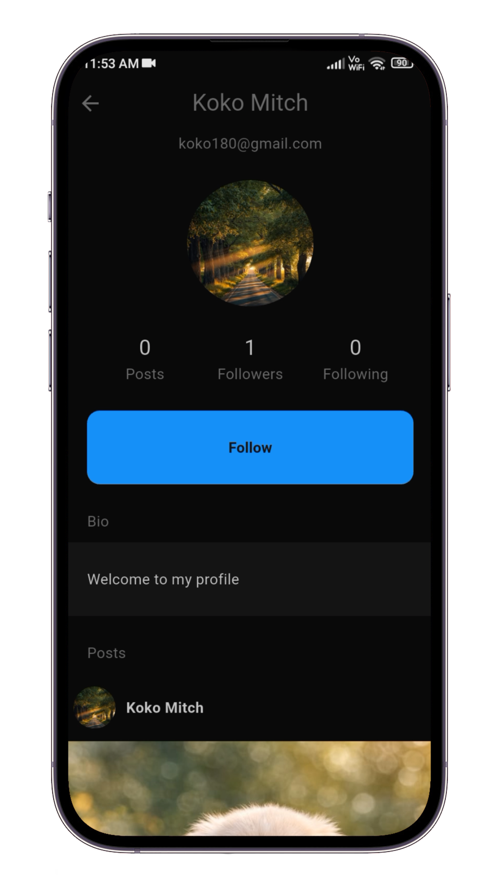
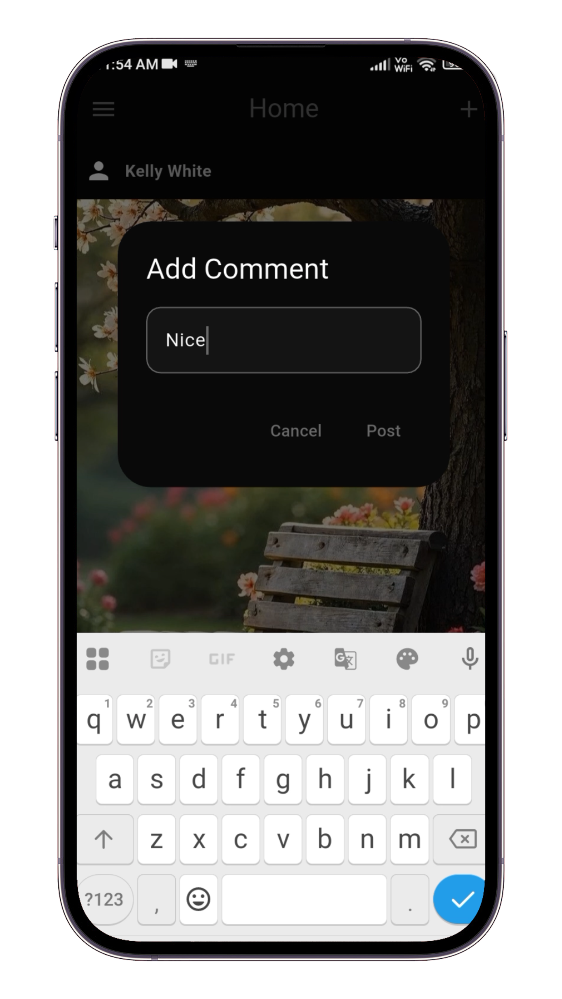
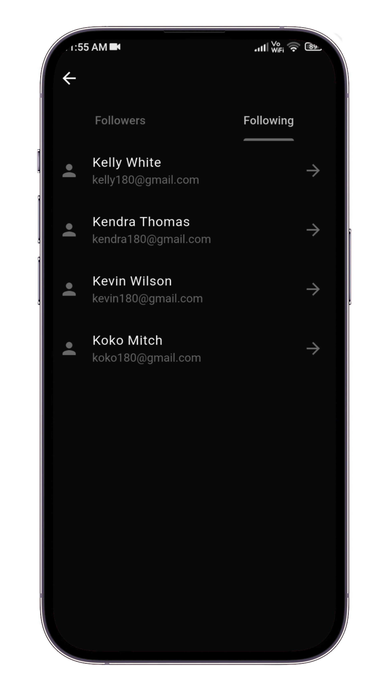
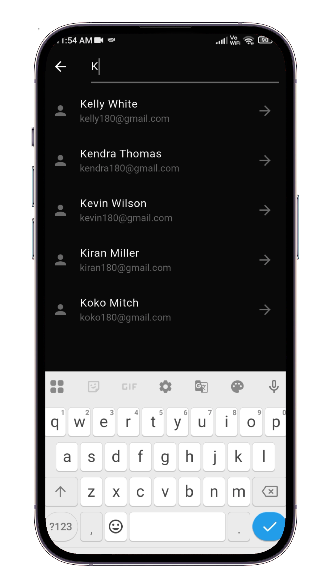

## 📱 Social Media Application

A full-featured social media mobile application built with Flutter.
Users can create posts, follow and unfollow other users, search profiles, and interact in a social environment.
The app uses a hybrid backend approach with Firebase and Supabase.

## 📸 Screenshots

  <table>
    <tr>
      <td align="center"> <b>Social Feed</b></td>
      <td align="center"> <b>Follow User</b></td>
      <td align="center"> <b>Comments</b></td>
    </tr>
    <tr>
      <td align="center"> <b>Following & Followers List</b></td>
      <td align="center"> <b>User Search</b></td>
      <td></td> <!-- Empty cell for balance -->
    </tr>
  </table>

## 🔗 Links

- 🌐 **Live Demo:** ▶️ [View Live Demo](https://social-media-app-b5b05.web.app/)
- 🎥 **Demo Video:** ▶️ [Watch Demo Video](https://www.linkedin.com/posts/anandu-udayan_excited-to-share-my-latest-project-a-full-ugcPost-7434488112850038784-KmNY?utm_source=share&utm_medium=member_desktop&rcm=ACoAACfMfq4Bd2BEG7zy_XRhdsPvceyXqd0TK4c)

## 🚀 Features

- 🔐 Secure Authentication using Firebase Auth
- 📰 Social feed using Cloud Firestore
- 🖼 Image and profile picture upload using Supabase Storage
- 👤 User profile with post history
- ➕ Follow and Unfollow users
- 👥 View followers and following count
- 🔍 Search user profiles efficiently
- ❤️ Like and 💬 Comment on posts
- 🌗 Light and Dark theme support
- 🎯 Optimized and smooth UI performance
- 📱 Fully Responsive UI (works across different screen sizes)
- ⚙ State management using flutter_bloc (Cubit)
- 🧱 Clean Architecture with Feature-first folder structure

## 🛠 Tech Used

- Flutter
- Dart
- flutter_bloc (Cubit)
- Firebase Authentication
- Cloud Firestore
- Supabase Storage
- Clean Architecture (Data, Domain, Presentation layers)

## 🏗 Architecture

This project follows Clean Architecture principles:

- Clear separation of Presentation, Domain, and Data layers
- Feature-first modular structure
- Repository pattern implementation
- Scalable and maintainable codebase
- Proper state handling with predictable state transitions

The hybrid backend strategy improves scalability by separating authentication/database (Firebase) and media storage (Supabase).

## 📥 Web Support

This application is responsive and deployed on Firebase Hosting.

## 👨‍💻 Developer

Author: Anandu Udayan
Email: anandu.dev180@gmail.com
